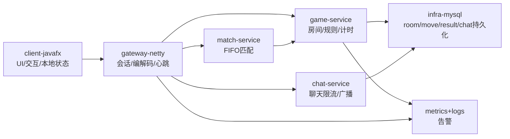
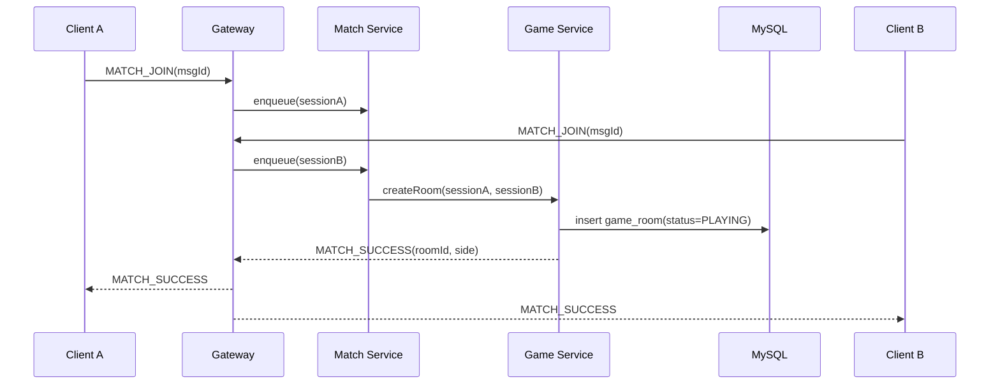

# ChuHanAI 阶段一 MVP 技术方案

## 1. 需求理解与 MVP 范围

### 目标概述
阶段一目标是交付“可直接打开即玩”的联网中国象棋系统，覆盖匿名匹配、实时对弈、基础社交与稳定交付能力，优先保证规则正确与对局一致性。

成功标准：
- 启动后 10 秒内可进入匹配队列
- 匹配后稳定开局，规则判定正确
- 支持悔棋、求和、认输、计时、聊天
- macOS/Windows 可运行并完成完整对局

### MVP 功能清单（P0）
- 联网匹配：单池 FIFO
- 房间管理：红黑分配、回合推进、状态广播
- 服务端权威规则引擎：走法、将军/将死、超时、认输、求和
- 计时系统：10min 基础时长 + 每步 15s（服务端推进）
- 聊天系统：房间内双人聊天，长度与频率限制
- 断线重连基础版：重连后局面重同步
- 最小可观测性：核心日志、关键指标、基础告警
- 跨平台交付：macOS/Windows 打包并冒烟通过

### 非 MVP（明确不做项）
- 注册/登录与账号体系
- 段位/ELO 复杂匹配
- AI 自主训练
- 观战、棋谱导出、复盘（P2）

### 假设与边界
- 阶段一为低并发，单池 FIFO 可满足需求
- 暂不引入 Redis/Kafka，以进程内状态 + MySQL 落库为主
- 客户端可做本地非法预判提示，最终以服务端裁决为准

### 本地环境与配置基线（已验证可用）
- **MySQL（默认必需）**：本地 `chu_han_ai` 库已就绪，阶段一开发/联调按该配置执行
- **Redis（可选）**：本地 Redis 可用，阶段一默认关闭；仅在需要做会话缓存、限流计数或匹配队列优化时开启

建议 Spring Boot 本地配置（`application-local.yml`）：

```yaml
spring:
  datasource:
    driver-class-name: com.mysql.cj.jdbc.Driver
    url: jdbc:mysql://localhost:3306/chu_han_ai?useUnicode=true&characterEncoding=utf-8&useSSL=false&serverTimezone=Asia/Shanghai
    username: root
    password: root

  data:
    redis:
      database: 1
      host: localhost
      port: 6379
      timeout: 5s
      connect-timeout: 5s
```

启用策略：
- 默认：仅启用 MySQL，Redis 相关能力不作为阶段一上线前置条件
- 可选：通过配置开关启用 Redis（例如 `feature.redis-enabled=true`），用于平滑验证缓存/限流方案
- 发布：生产环境账号密码与连接参数通过环境变量或密钥管理注入，禁止明文写入仓库

## 2. 技术架构方案

### 架构说明（Mermaid）


### 模块划分与职责
- `chuhanai-client-javafx`：棋盘渲染、交互、状态展示、断线提示与重建
- `chuhanai-server-gateway`：Netty 接入、编解码、会话管理、心跳保活
- `chuhanai-server-match`：匿名入队、FIFO 配对、超时清理
- `chuhanai-server-game`：房间生命周期、规则引擎、计时推进、结算
- `chuhanai-server-chat`：聊天广播、限流与安全校验
- `chuhanai-server-infra`：MySQL 持久化、事务、审计日志

### 关键技术选型与理由
- **JDK 21**：与当前 PRD 保持一致，稳定且成熟
- **Spring Boot 3.5.x**：2025 正式版本，工程化与运维能力完善
- **Netty 4.2.x**：实时通信性能优先，迁移与兼容指南清晰
- **JavaFX/OpenJFX**：跨平台桌面 UI 技术栈，贴合客户端形态
- **MySQL 8.4 LTS**：LTS 轨道，生产变更风险更可控

## 3. 数据与接口设计

### 3.1 数据库设计原则
- 单库 `chu_han_ai`，所有时间字段使用 `datetime(3)`，统一 UTC 存储、应用层按 `Asia/Shanghai` 展示
- 强一致主链路：走子、悔棋、求和、认输、结算都在服务端串行裁决后落库
- 读写分层：`game_room` 持有当前态；`game_move/game_control_event/chat_message` 记录事件流
- 幂等优先：所有写请求先过 `idempotent_message`，保证“同一请求只生效一次”

### 3.2 核心库表设计（MVP）

#### A0. 匹配队列表 `match_queue`
用途：与 PRD 最小数据模型保持一致；阶段一低并发下可选“内存队列为主 + 本表审计/兜底”。

```sql
CREATE TABLE match_queue (
  id BIGINT PRIMARY KEY AUTO_INCREMENT,
  session_id VARCHAR(64) NOT NULL,
  enqueue_msg_id VARCHAR(64) NOT NULL,
  status TINYINT NOT NULL COMMENT '0-QUEUED,1-MATCHED,2-CANCELLED,3-TIMEOUT',
  enqueue_at DATETIME(3) NOT NULL,
  dequeue_at DATETIME(3) NULL,
  matched_room_id VARCHAR(32) NULL,
  UNIQUE KEY uk_match_enqueue_msg (enqueue_msg_id),
  INDEX idx_match_session_status (session_id, status),
  INDEX idx_match_status_enqueue (status, enqueue_at)
) ENGINE=InnoDB DEFAULT CHARSET=utf8mb4;
```

#### A. 对局主表 `game_room`
用途：房间当前状态与计时权威数据（高频读）。

```sql
CREATE TABLE game_room (
  id BIGINT PRIMARY KEY AUTO_INCREMENT,
  room_id VARCHAR(32) NOT NULL UNIQUE,
  status TINYINT NOT NULL COMMENT '0-WAITING,1-PLAYING,2-FINISHED,3-CANCELLED',
  red_session_id VARCHAR(64) NOT NULL,
  black_session_id VARCHAR(64) NOT NULL,
  current_turn TINYINT NOT NULL COMMENT '1-RED,2-BLACK',
  board_fen VARCHAR(255) NOT NULL COMMENT '当前局面序列化',
  move_no INT NOT NULL DEFAULT 0,
  red_time_left_ms INT NOT NULL,
  black_time_left_ms INT NOT NULL,
  base_time_ms INT NOT NULL DEFAULT 600000,
  increment_ms INT NOT NULL DEFAULT 15000,
  last_move_at DATETIME(3) NULL,
  version INT NOT NULL DEFAULT 0 COMMENT '乐观锁版本号',
  created_at DATETIME(3) NOT NULL,
  updated_at DATETIME(3) NOT NULL,
  INDEX idx_room_status (status),
  INDEX idx_room_red_session (red_session_id),
  INDEX idx_room_black_session (black_session_id)
) ENGINE=InnoDB DEFAULT CHARSET=utf8mb4;
```

#### B. 走子事件表 `game_move`
用途：完整棋谱、回放、争议追踪、重连增量同步。

```sql
CREATE TABLE game_move (
  id BIGINT PRIMARY KEY AUTO_INCREMENT,
  room_id VARCHAR(32) NOT NULL,
  move_no INT NOT NULL,
  side TINYINT NOT NULL COMMENT '1-RED,2-BLACK',
  piece VARCHAR(16) NOT NULL,
  from_pos CHAR(2) NOT NULL,
  to_pos CHAR(2) NOT NULL,
  think_time_ms INT NOT NULL,
  board_fen_before VARCHAR(255) NOT NULL,
  board_fen_after VARCHAR(255) NOT NULL,
  captured_piece VARCHAR(16) NULL,
  request_msg_id VARCHAR(64) NOT NULL,
  created_at DATETIME(3) NOT NULL,
  UNIQUE KEY uk_room_move_no (room_id, move_no),
  UNIQUE KEY uk_room_msg_id (room_id, request_msg_id),
  INDEX idx_move_room_created (room_id, created_at)
) ENGINE=InnoDB DEFAULT CHARSET=utf8mb4;
```

#### C. 控制事件表 `game_control_event`
用途：悔棋/求和/认输等非走子控制链路审计。

```sql
CREATE TABLE game_control_event (
  id BIGINT PRIMARY KEY AUTO_INCREMENT,
  room_id VARCHAR(32) NOT NULL,
  event_type VARCHAR(24) NOT NULL COMMENT 'UNDO_REQ/UNDO_RESP/DRAW_REQ/DRAW_RESP/RESIGN',
  initiator_session_id VARCHAR(64) NOT NULL,
  target_session_id VARCHAR(64) NULL,
  decision VARCHAR(16) NULL COMMENT 'ACCEPT/REJECT/TIMEOUT',
  request_msg_id VARCHAR(64) NOT NULL,
  related_move_no INT NULL,
  extra_json JSON NULL,
  created_at DATETIME(3) NOT NULL,
  UNIQUE KEY uk_ctrl_room_msg_id (room_id, request_msg_id),
  INDEX idx_ctrl_room_created (room_id, created_at)
) ENGINE=InnoDB DEFAULT CHARSET=utf8mb4;
```

#### D. 对局结果表 `game_result`
用途：最终结果、统计聚合、后续排行榜扩展基础。

```sql
CREATE TABLE game_result (
  id BIGINT PRIMARY KEY AUTO_INCREMENT,
  room_id VARCHAR(32) NOT NULL UNIQUE,
  winner_side TINYINT NOT NULL COMMENT '0-DRAW,1-RED,2-BLACK',
  finish_reason VARCHAR(24) NOT NULL COMMENT 'CHECKMATE/RESIGN/TIMEOUT/DRAW_AGREED/DRAW_STALEMATE',
  total_move_count INT NOT NULL,
  duration_ms INT NOT NULL,
  final_fen VARCHAR(255) NOT NULL,
  finished_at DATETIME(3) NOT NULL,
  created_at DATETIME(3) NOT NULL,
  INDEX idx_result_finished_at (finished_at)
) ENGINE=InnoDB DEFAULT CHARSET=utf8mb4;
```

#### E. 聊天消息表 `chat_message`
用途：房间内聊天存档与风控追溯。

```sql
CREATE TABLE chat_message (
  id BIGINT PRIMARY KEY AUTO_INCREMENT,
  room_id VARCHAR(32) NOT NULL,
  sender_session_id VARCHAR(64) NOT NULL,
  content VARCHAR(300) NOT NULL,
  content_safe TINYINT NOT NULL DEFAULT 1 COMMENT '1-通过,0-拦截',
  request_msg_id VARCHAR(64) NOT NULL,
  created_at DATETIME(3) NOT NULL,
  UNIQUE KEY uk_chat_room_msg_id (room_id, request_msg_id),
  INDEX idx_chat_room_created (room_id, created_at)
) ENGINE=InnoDB DEFAULT CHARSET=utf8mb4;
```

#### F. 幂等日志表 `idempotent_message`
用途：写请求防重与失败重试安全。

```sql
CREATE TABLE idempotent_message (
  id BIGINT PRIMARY KEY AUTO_INCREMENT,
  biz_scope VARCHAR(32) NOT NULL COMMENT 'MATCH/ROOM/CHAT/SYSTEM',
  room_id VARCHAR(32) NULL,
  session_id VARCHAR(64) NOT NULL,
  msg_id VARCHAR(64) NOT NULL,
  msg_type VARCHAR(32) NOT NULL,
  process_status TINYINT NOT NULL COMMENT '0-PENDING,1-SUCCESS,2-FAILED',
  response_json JSON NULL,
  created_at DATETIME(3) NOT NULL,
  updated_at DATETIME(3) NOT NULL,
  UNIQUE KEY uk_idem_scope_msg (biz_scope, msg_id),
  UNIQUE KEY uk_idem_session_msg (session_id, msg_id),
  INDEX idx_idem_session_created (session_id, created_at)
) ENGINE=InnoDB DEFAULT CHARSET=utf8mb4;
```

### 3.3 关键接口/服务边界
- 匹配：`MATCH_JOIN` / `MATCH_CANCEL` / `MATCH_SUCCESS`
- 走子：`MOVE_REQUEST` / `MOVE_ACCEPTED` / `MOVE_REJECTED`
- 控制：`UNDO_REQUEST` / `UNDO_RESPONSE`、`DRAW_REQUEST` / `DRAW_RESPONSE`、`RESIGN`
- 同步：`SNAPSHOT_SYNC`、`TIME_SYNC`、`GAME_OVER`、`PING` / `PONG`
- 聊天：`CHAT_SEND` / `CHAT_BROADCAST`

每条消息统一包含：`msgId`、`roomId`、`sessionId`、`timestamp`、`payload`。

协议补充（满足 PRD 对“消息序列号”的要求）：
- 增加会话级字段：`seq`（客户端单调递增）与 `ackSeq`（服务端确认到的最后连续序号）
- 顺序处理策略：同一 `sessionId` 下仅接受 `seq > lastSeq` 的消息；跳号进入短暂等待窗口，超时按乱序丢弃并返回错误码
- 重放防护：`msgId` 幂等 + `seq` 顺序双重校验

### 3.4 整体流程设计（端到端）

#### 流程 1：匹配 -> 开局


关键落库点：
- `game_room` 创建成功才允许下发 `MATCH_SUCCESS`
- 任一推送失败时，房间保持 `PLAYING`，依赖重连流程恢复

#### 流程 2：落子裁决（主链路）
1. 客户端发送 `MOVE_REQUEST`（包含 `msgId + moveNo`）
2. 网关鉴权会话并转发到 `game-service`
3. `game-service` 先检查 `idempotent_message`，命中则直接返回历史结果
4. 未命中时执行规则校验（回合方、走法合法、将帅照面、将军解将等）
5. 校验通过后，单事务写入：
   - `idempotent_message(process_status=SUCCESS)`
   - `game_move`
   - `game_room`（局面、回合、计时、版本号）
6. 广播 `MOVE_ACCEPTED + TIME_SYNC` 给双方
7. 若触发终局，继续写 `game_result` 并广播 `GAME_OVER`

事务边界建议：
- 使用“房间维度串行执行器（单线程队列）+ 数据库事务”避免并发落子冲突
- `game_room.version` 用于兜底乐观锁，防止异常重入

#### 流程 3：控制指令（悔棋/求和/认输）
- `UNDO_REQUEST` / `DRAW_REQUEST`：
  - 先写 `game_control_event(event_type=*_REQ)`
  - 转发给对手等待 `*_RESPONSE`
  - 对手同意后更新 `game_room`（悔棋仅回退一步，回退 `board_fen/current_turn/move_no/双方剩余时间`，或和棋结束）
- `RESIGN`：
  - 直接写 `game_control_event(RESIGN)` + `game_result`
  - 更新 `game_room.status=FINISHED` 并广播 `GAME_OVER`

#### 流程 4：断线重连与状态恢复
1. 客户端重连后发送 `SNAPSHOT_SYNC` 请求
2. 服务端返回：
   - `game_room` 当前态（`board_fen/current_turn/time_left/status`）
   - `game_move` 最近 N 步（建议 N=20）
   - 如有未决控制请求，返回待响应事件（来自 `game_control_event`）
3. 客户端以服务端快照为准重建界面并继续对局

#### 流程 5：对局结束与归档
- 触发条件：将死、认输、求和达成、超时
- 处理顺序：
  1) 原子更新 `game_room.status=FINISHED`
  2) 插入 `game_result`
  3) 广播 `GAME_OVER`
  4) 异步输出可观测日志（roomId、finishReason、duration、moves）

### 3.5 状态流转与异常处理策略
- 对局状态：`WAITING -> PLAYING -> FINISHED`
- 幂等键：`(biz_scope, msg_id)`；匹配和房间内消息分别隔离去重，任何写请求可重试且不重复生效
- 业务异常：
  - 非本人回合 -> `TURN_CONFLICT`
  - 非法走子 -> `MOVE_ILLEGAL`
  - 房间已结束 -> `ROOM_FINISHED`
  - 请求超时 -> `REQUEST_TIMEOUT`
- 系统异常：统一 `SYSTEM_ERROR`，附可重试标识；所有失败必须记录 `msgId`
- 数据恢复：`game_room` 为权威当前态，`game_move` 为权威历史；冲突时以同一事务内最新 `game_room.version` 为准

说明：匹配态消息采用 `(biz_scope='MATCH', msg_id)` 去重；房间内消息采用 `(biz_scope='ROOM', msg_id)` 去重。

### 3.6 规则覆盖与 PRD 对齐清单（阶段一必须）
- 棋子走法：将/士/象/马/车/炮/兵（卒）全覆盖，含蹩马腿、塞象眼、炮架、将帅不可照面
- 终局判定：将死、认输、求和达成、超时判负
- 解将合法性：仅允许“吃将子、挡将线、帅（将）位移解将”三类有效应对
- 困毙（无子可走且未被将军）：按和棋处理（`finish_reason=DRAW_STALEMATE`）
- 悔棋：仅支持悔一步，需对手同意，回退局面 + 回合 + 计时

## 4. 实施计划

### M1（第 1 周）基础工程与协议骨架
- 目标：项目结构、网关收发、棋盘 UI 初版
- 交付物：多模块工程、基础协议、棋盘渲染
- 验收：单机可渲染局面，网关心跳可用

### M2（第 2 周）联机主链路打通
- 目标：匹配 -> 开局 -> 走子同步闭环
- 交付物：匹配队列、房间创建、走子路由与广播
- 验收：双客户端可完成基础联机对局

### M3（第 3 周）规则与对局控制完善
- 目标：规则完整、计时、悔棋/求和/认输、断线重连
- 交付物：规则引擎、计时模块、控制命令、快照同步
- 验收：规则测试高覆盖，关键场景稳定

### M4（第 4 周）稳定化与发布候选
- 目标：跨平台打包、回归、监控告警、发布回滚就绪
- 交付物：macOS/Windows 包、告警规则、发布回滚文档
- 验收：100 局内部对战无严重规则错误

## 5. 风险与保障

### 主要技术风险与缓解措施
- 规则复杂易误判：服务端唯一判定 + 高密度单测 + 快照回放
- 网络抖动状态不一致：心跳、幂等、重连重同步
- 跨平台 UI 差异：双平台提前并行验证
- 范围蔓延：M3 后冻结 P2，新增需求必须评审优先级

### 性能、安全、稳定性与可观测性要点
- 性能：匹配 P95 < 2s，走子确认 P95 < 300ms
- 安全：输入校验、消息限流、聊天内容约束、TLS 校验策略明确
- 稳定：异常兜底、超时剔除、重试与回滚
- 可观测：记录 `msgId/roomId/sessionId/type/result`，建立关键指标告警

## 6. 调研依据与引用（结论 -> 证据来源）

检索时间：2026-03-12

1. Spring Boot 3.5 正式发布，可作为 2025+ 稳定基线  
   - 标题：Spring Boot 3.5.0 available now  
   - 链接：https://spring.io/blog/2025/05/22/spring-boot-3-5-0-available-now  
   - 发布时间：2025-05-22

2. Spring Boot 系统要求显示可兼容 Java 17~25  
   - 标题：System Requirements :: Spring Boot  
   - 链接：https://docs.spring.io/spring-boot/system-requirements.html  
   - 版本信息：Spring Boot 4.0.3 文档页

3. Netty 4.2.0.Final 发布，4.1 用户可升级  
   - 标题：Netty 4.2.0.Final released  
   - 链接：https://netty.io/news/2025/04/03/4-2-0.html  
   - 发布时间：2025-04-03

4. Netty 4.2 迁移需要关注 TLS 默认校验与分配器变更  
   - 标题：Netty 4.2 Migration Guide  
   - 链接：https://netty.io/wiki/netty-4.2-migration-guide.html  
   - 版本信息：官方迁移指南

5. JavaFX 25 已在 2025 年 GA  
   - 标题：JavaFX 25 General Availability  
   - 链接：https://mail.openjdk.org/pipermail/openjfx-dev/2025-September/056290.html  
   - 发布时间：2025-09-17

6. JavaFX 25 重要变化（JDK 要求、特性与移除项）  
   - 标题：JavaFX 25 Highlights  
   - 链接：https://openjfx.io/highlights/25  
   - 版本信息：JavaFX 25

7. MySQL 官方 Innovation/LTS 双轨，LTS 更适合稳态生产  
   - 标题：MySQL Releases: Innovation and LTS  
   - 链接：https://dev.mysql.com/doc/refman/en/mysql-releases.html  
   - 版本信息：MySQL 8.4 Reference Manual

8. Oracle Java SE Roadmap 显示 JDK 21 与 25 的支持窗口  
   - 标题：Oracle Java SE Support Roadmap  
   - 链接：https://www.oracle.com/technetwork/java/java-se-support-roadmap.html  
   - 更新时间：2025-09-16
