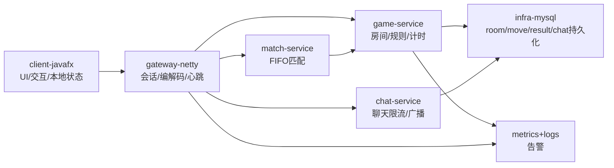

# ChuHanAI 阶段一 MVP 技术方案

## 1. 需求理解与 MVP 范围

### 目标概述
阶段一目标是交付“可直接打开即玩”的联网中国象棋系统，覆盖匿名匹配、实时对弈、基础社交与稳定交付能力，优先保证规则正确与对局一致性。

成功标准：
- 启动后 10 秒内可进入匹配队列
- 匹配后稳定开局，规则判定正确
- 支持悔棋、求和、认输、计时、聊天
- macOS/Windows 可运行并完成完整对局

### MVP 功能清单（P0）
- 联网匹配：单池 FIFO
- 房间管理：红黑分配、回合推进、状态广播
- 服务端权威规则引擎：走法、将军/将死、超时、认输、求和
- 计时系统：10min 基础时长 + 每步 15s（服务端推进）
- 聊天系统：房间内双人聊天，长度与频率限制
- 断线重连基础版：重连后局面重同步
- 最小可观测性：核心日志、关键指标、基础告警
- 跨平台交付：macOS/Windows 打包并冒烟通过

### 非 MVP（明确不做项）
- 注册/登录与账号体系
- 段位/ELO 复杂匹配
- AI 自主训练
- 观战、棋谱导出、复盘（P2）

### 假设与边界
- 阶段一为低并发，单池 FIFO 可满足需求
- 暂不引入 Redis/Kafka，以进程内状态 + MySQL 落库为主
- 客户端可做本地非法预判提示，最终以服务端裁决为准

## 2. 技术架构方案

### 架构说明（Mermaid）

### 模块划分与职责
- `chuhanai-client-javafx`：棋盘渲染、交互、状态展示、断线提示与重建
- `chuhanai-server-gateway`：Netty 接入、编解码、会话管理、心跳保活
- `chuhanai-server-match`：匿名入队、FIFO 配对、超时清理
- `chuhanai-server-game`：房间生命周期、规则引擎、计时推进、结算
- `chuhanai-server-chat`：聊天广播、限流与安全校验
- `chuhanai-server-infra`：MySQL 持久化、事务、审计日志

### 关键技术选型与理由
- **JDK 21**：与当前 PRD 保持一致，稳定且成熟
- **Spring Boot 3.5.x**：2025 正式版本，工程化与运维能力完善
- **Netty 4.2.x**：实时通信性能优先，迁移与兼容指南清晰
- **JavaFX/OpenJFX**：跨平台桌面 UI 技术栈，贴合客户端形态
- **MySQL 8.4 LTS**：LTS 轨道，生产变更风险更可控

## 3. 数据与接口设计

### 核心数据模型
- `game_room`：房间、双方 session、回合、计时、状态
- `game_move`：步号、阵营、棋子、起止坐标、耗时、快照
- `game_result`：胜方、结束原因、总步数、结束时间
- `chat_message`：房间、发送者、内容、发送时间

### 关键接口/服务边界
- 匹配：`MATCH_JOIN` / `MATCH_SUCCESS`
- 走子：`MOVE_REQUEST` / `MOVE_ACCEPTED` / `MOVE_REJECTED`
- 控制：`UNDO_REQUEST` / `UNDO_RESPONSE`、`DRAW_REQUEST` / `DRAW_RESPONSE`、`RESIGN`
- 实时：`TIME_SYNC`、`GAME_OVER`、`PING` / `PONG`
- 聊天：`CHAT_SEND` / `CHAT_BROADCAST`

每条消息统一包含：`msgId`、`roomId`、`sessionId`、`timestamp`、`payload`。

### 状态流转与异常处理策略
- 对局状态：`WAITING -> PLAYING -> FINISHED`
- 幂等：写操作按 `roomId + msgId` 去重，重复请求返回同一业务结果
- 业务异常：非法走子/非本人回合/房间状态冲突分别返回明确错误码
- 系统异常：统一失败响应 + 可重试语义 + 日志可追踪
- 重连重同步：返回“房间快照 + 最近 N 步 move + 当前计时”

## 4. 实施计划

### M1（第 1 周）基础工程与协议骨架
- 目标：项目结构、网关收发、棋盘 UI 初版
- 交付物：多模块工程、基础协议、棋盘渲染
- 验收：单机可渲染局面，网关心跳可用

### M2（第 2 周）联机主链路打通
- 目标：匹配 -> 开局 -> 走子同步闭环
- 交付物：匹配队列、房间创建、走子路由与广播
- 验收：双客户端可完成基础联机对局

### M3（第 3 周）规则与对局控制完善
- 目标：规则完整、计时、悔棋/求和/认输、断线重连
- 交付物：规则引擎、计时模块、控制命令、快照同步
- 验收：规则测试高覆盖，关键场景稳定

### M4（第 4 周）稳定化与发布候选
- 目标：跨平台打包、回归、监控告警、发布回滚就绪
- 交付物：macOS/Windows 包、告警规则、发布回滚文档
- 验收：100 局内部对战无严重规则错误

## 5. 风险与保障

### 主要技术风险与缓解措施
- 规则复杂易误判：服务端唯一判定 + 高密度单测 + 快照回放
- 网络抖动状态不一致：心跳、幂等、重连重同步
- 跨平台 UI 差异：双平台提前并行验证
- 范围蔓延：M3 后冻结 P2，新增需求必须评审优先级

### 性能、安全、稳定性与可观测性要点
- 性能：匹配 P95 < 2s，走子确认 P95 < 300ms
- 安全：输入校验、消息限流、聊天内容约束、TLS 校验策略明确
- 稳定：异常兜底、超时剔除、重试与回滚
- 可观测：记录 `msgId/roomId/sessionId/type/result`，建立关键指标告警

## 6. 调研依据与引用（结论 -> 证据来源）

检索时间：2026-03-12

1. Spring Boot 3.5 正式发布，可作为 2025+ 稳定基线  
   - 标题：Spring Boot 3.5.0 available now  
   - 链接：https://spring.io/blog/2025/05/22/spring-boot-3-5-0-available-now  
   - 发布时间：2025-05-22

2. Spring Boot 系统要求显示可兼容 Java 17~25  
   - 标题：System Requirements :: Spring Boot  
   - 链接：https://docs.spring.io/spring-boot/system-requirements.html  
   - 版本信息：Spring Boot 4.0.3 文档页

3. Netty 4.2.0.Final 发布，4.1 用户可升级  
   - 标题：Netty 4.2.0.Final released  
   - 链接：https://netty.io/news/2025/04/03/4-2-0.html  
   - 发布时间：2025-04-03

4. Netty 4.2 迁移需要关注 TLS 默认校验与分配器变更  
   - 标题：Netty 4.2 Migration Guide  
   - 链接：https://netty.io/wiki/netty-4.2-migration-guide.html  
   - 版本信息：官方迁移指南

5. JavaFX 25 已在 2025 年 GA  
   - 标题：JavaFX 25 General Availability  
   - 链接：https://mail.openjdk.org/pipermail/openjfx-dev/2025-September/056290.html  
   - 发布时间：2025-09-17

6. JavaFX 25 重要变化（JDK 要求、特性与移除项）  
   - 标题：JavaFX 25 Highlights  
   - 链接：https://openjfx.io/highlights/25  
   - 版本信息：JavaFX 25

7. MySQL 官方 Innovation/LTS 双轨，LTS 更适合稳态生产  
   - 标题：MySQL Releases: Innovation and LTS  
   - 链接：https://dev.mysql.com/doc/refman/en/mysql-releases.html  
   - 版本信息：MySQL 8.4 Reference Manual

8. Oracle Java SE Roadmap 显示 JDK 21 与 25 的支持窗口  
   - 标题：Oracle Java SE Support Roadmap  
   - 链接：https://www.oracle.com/technetwork/java/java-se-support-roadmap.html  
   - 更新时间：2025-09-16
